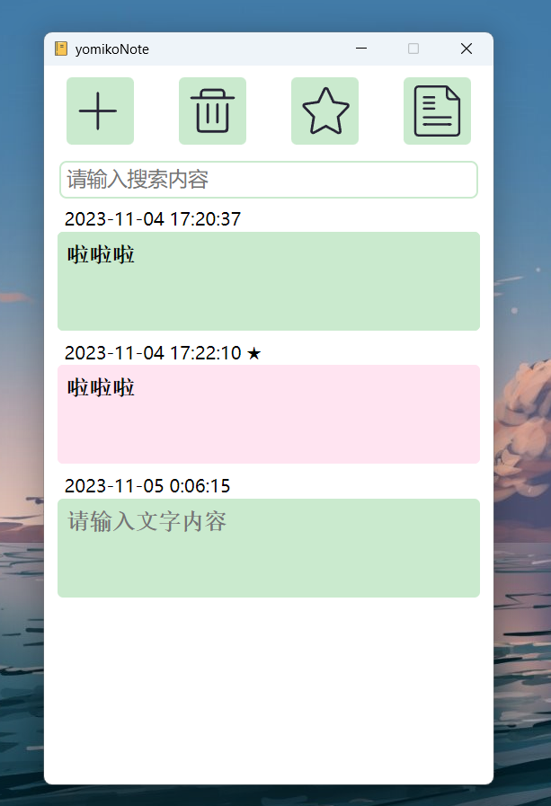

# yomikoNote

只是一个业余萌新捣鼓出来的小工具啦，主要用的是Tauri框架，水平有限，所以代码写的非常丑陋，不过还是欢迎各位大佬来试一试啦，软件体积只有5M哦，不占空间的啦。

一开始是觉得win11自代的便笺不太符合我的喜好，想要一个更加简单，更加纯粹的便笺软件（说人话就是除了记录文本外不要有任何其他功能）。于是乎，在经历了与rust编译器一番斗智斗勇（被按在地上摩擦）之后，终于诞生了这个yomikoNote!

软件功能非常简单：

+ 顶部四个按钮分别为：添加新便笺、删除便笺、标注便笺、复制便笺文本。其中标注功能只有视觉上的强调作用。
+ 软件采用实时自动保存，保存延迟1秒钟。换句话说，在完成文本输入后，1秒钟之内请勿关闭软件，否则将无法顺利保存！
  
软件界面如图：

  